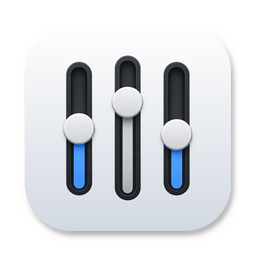

<a id="top"></a>

<p align="center">
  
</p>

<h1 align="center">MacMiniMixer</h1>

<p align="center">
  <strong>A volume mixer for every app on your Mac.</strong>
</p>

<p align="center">
  A native, lightweight macOS menu bar app that gives each app its own volume and mute — like the Windows Volume Mixer.<br>
  Public Core Audio APIs only: no audio driver, no virtual device, no Dock icon.
</p>

<p align="center">
  
  
  
  
</p>

<p align="center">
  <a href="https://github.com/akwnnwastaken/MacMiniMixer/releases/download/v0.14.1/MacMiniMixer-0.14.1.zip"><strong>Download for macOS</strong></a>
  &nbsp;·&nbsp;
  <a href="https://github.com/akwnnwastaken/MacMiniMixer/releases/tag/v0.14.1"><strong>Release notes</strong></a>
  &nbsp;·&nbsp;
  <a href="#build-from-source"><strong>Build from source</strong></a>
</p>

---

MacMiniMixer sits in your menu bar, next to the system volume, and lets you turn one app up, down or off without touching the rest. Its panel brings the system output, the output device and every app's volume together in one place.

## Features

- **Per-app volume and mute:** Move an app's slider or click its mute, and only that app changes — turn the music down under a video call, or silence one noisy app and leave everything else alone.
- **No app-count limit:** Control as many apps at once as you like.
- **Browsers and web apps:** Safari and a Safari web app, or Chrome and a Chrome PWA / Canary, are separate rows that can each be controlled.
- **Crackle-free output:** A direct output engine plays at your device's own sample rate and never changes it.
- **Always on, nothing automatic:** There is no toggle, and nothing is captured until you touch a row. Rows you have not touched yet are a UI preview and change no audio.
- **System output:** System volume and mute, kept in sync live while the panel is open, plus the output device list and switching, refreshed live (for example when AirPods connect).
- **Read-only badge:** Outputs that have no writable volume are marked before you drag anything.
- **Simple panel:** A `⋯` menu with **Show all apps** and **Quit MacMiniMixer**, and a one-line banner — "N apps controlled" — with **Stop** or **Stop All**.
- **Menu bar only:** No Dock icon and no window. Labels and hints for VoiceOver are included.
- **Local and private:** Audio is processed live and never written to disk.

## Downloads

Version **0.14.1** is current.

| Platform | Package | Download | Release notes |
| --- | --- | --- | --- |
| macOS 13+ (per-app control: macOS 14.2+) | `MacMiniMixer-0.14.1.zip` | [Download ZIP](https://github.com/akwnnwastaken/MacMiniMixer/releases/download/v0.14.1/MacMiniMixer-0.14.1.zip) · [SHA-256](https://github.com/akwnnwastaken/MacMiniMixer/releases/download/v0.14.1/MacMiniMixer-0.14.1.zip.sha256) | [`v0.14.1`](https://github.com/akwnnwastaken/MacMiniMixer/releases/tag/v0.14.1) |

> [!NOTE]
> The build is **ad-hoc signed and not notarized**, so macOS blocks the first launch — see [Installation](#installation) for the one-time steps.

> [!NOTE]
> v0.14.1 is pre-1.0 and experimental. It is not a finished Windows Volume Mixer replacement, and it is not on the Mac App Store.

---

## How it works

Every app you touch gets its own **Core Audio Process Tap**: its audio is captured, the original is muted, and the same audio is played back at the volume you chose. A tap covers every audio process of the app, attributed by resource coalition, which is why browsers and web apps work.

| | Direct output (default) | Legacy AudioQueue (fallback) |
|---|---|---|
| Mechanism | One private aggregate device = your output device + the app's tap; one IOProc writes the gained audio to the device | A tap-only aggregate hands buffers to a separate `AudioQueue` on the output device |
| Clocks | one | two |
| Crackle | none heard in owner tests | could crackle at random |
| Used when | output-only devices: built-in speakers, HDMI, USB DACs | the output also exposes input (microphone) streams, or direct setup fails |

The legacy path is used for some USB headsets, audio interfaces, and AirPods while their microphone is in use (calls). Audio still works there.

The direct engine plays at the device's own sample rate and never changes it. In the owner's tests (one Mac), the built-in speakers at 44.1 and 48 kHz (up to **six apps at once**) and AirPods in normal listening all played with no crackle heard. Each Real app costs its own CPU; the owner's Activity Monitor showed about 3.6% with the panel closed and up to 7% with it open (v0.14; the number of apps was not recorded).

### Known limits

- Resource use (CPU, memory, Stop All, sleep) has been measured with up to **three** simultaneous apps; with more it is **not measured**.
- The direct engine is checked on a few setups only; other devices, sample rates and macOS versions are unverified.
- To tell Safari from a Safari web app, the app asks the public `proc_pidinfo` for an undocumented flavor (`PROC_PIDCOALITIONINFO`). If a future macOS changes it, matching falls back to bundle-id rules, which are less precise.
- Starts are queued: with several rows requested at once they start one after another, and a browser row can take a second or more.

### Safety & Privacy

- **Live only** — Audio is processed live and is never written to disk.
- **No driver** — No virtual audio driver, no kernel extension, no HAL plug-in. The private aggregate devices exist only while a session runs and are destroyed when it stops.
- **Public APIs only** — No private APIs and no third-party dependencies; the one grey area is the `proc_pidinfo` flavor above.
- **Nothing starts on its own** — No capture at launch, none because an app appears in the list, none until you interact with its row. Helper discovery and diagnostics are user-triggered.
- **System changes are yours** — The default output device and the system volume change only when you use the output selector or the System Output controls. The device's sample rate is never touched.
- **Clean teardown** — Sessions are torn down on system sleep, output-device change, app quit, and when the app exits. Closing the panel does not stop active control; the menu bar icon and banner show that it is active.
- **Permission** — macOS asks for **System Audio Recording** the first time a row becomes Real.

> [!NOTE]
> Quitting MacMiniMixer restores every app's normal audio.

## Installation

### Download

1. Download `MacMiniMixer-0.14.1.zip` and `MacMiniMixer-0.14.1.zip.sha256` from [Downloads](#downloads) or the [Releases](https://github.com/akwnnwastaken/MacMiniMixer/releases) page.
2. Check the download:
   ```bash
   shasum -a 256 -c MacMiniMixer-0.14.1.zip.sha256
   ```
3. Unzip it and move `MacMiniMixer.app` to `/Applications`.
4. Open it once (see the warning below), then look for the icon in the menu bar.

> [!WARNING]
> The app is **ad-hoc signed and not notarized**, so Gatekeeper blocks the first launch. On **macOS 13–14**, right-click the app → **Open** → **Open**. On **macOS 15 and later**, try to open it once, then go to **System Settings → Privacy & Security → Open Anyway**. Or, in Terminal:
> ```bash
> xattr -dr com.apple.quarantine /Applications/MacMiniMixer.app
> ```
> Details are in [docs/RELEASING.md](docs/RELEASING.md#5-opening-an-ad-hoc-signed-build-end-users).

### Build from source

You need Xcode 16 or later (CI uses Xcode 16 on `macos-15`). There are no packages to fetch.

```bash
git clone https://github.com/akwnnwastaken/MacMiniMixer.git
cd MacMiniMixer
scripts/package-app.sh
```

This writes an ad-hoc signed `dist/MacMiniMixer-<version>.zip` (plus its `.sha256`). It builds Release into its own `./.DerivedData-release` folder with code coverage off, so test instrumentation never ends up in the audio path of the app you install.

Or open `MacMiniMixer.xcodeproj` in Xcode, select the `MacMiniMixer` scheme and press Run.

### Tests

```bash
xcodebuild test -project MacMiniMixer.xcodeproj -scheme MacMiniMixer \
  -destination 'platform=macOS' -derivedDataPath ./.DerivedData CODE_SIGNING_ALLOWED=NO
```

The suite covers pure logic, fake-backed coordinators and synthetic audio buffers. It does not exercise real Process Taps or devices, so no test captures real audio.

## Usage

1. Launch **MacMiniMixer** — a slider icon appears in your menu bar
2. Click the icon to open the panel: **System Output** on top, your **Applications** below (`⋯` → **Show all apps** reveals the rest)
3. Move an app's slider or click its mute
4. The first time, macOS asks for **System Audio Recording** — allow it
5. The row shows an orange **Real** badge and its slider now sets that app's real volume. Control other apps the same way — queued ones show a spinner and start one after another 🎚️
6. Click an app's **Real** badge to stop controlling it, or **Stop All** in the banner. Choose **Quit MacMiniMixer** in the `⋯` menu to stop everything

### Row and Menu Bar States

| Where | You see | Meaning |
|-------|---------|---------|
| Row | slider and mute, no badge | Preview only — nothing real happens until you move the slider or click mute (eligible apps then become Real) |
| Row | spinner and "Resolving" | Finding the audio process of a browser or helper row |
| Row | spinner badge | A start or stop is in flight, or this row is waiting its turn in the start queue |
| Row | orange **Real** badge | Per-app control is active; the slider is the app's real volume and mute is silence |
| System Output | **Read-only** | This output device has no writable volume |
| Menu bar | `slider.horizontal.3` 🎚️ | No app is under control |
| Menu bar | `waveform.circle.fill` 🌊 | At least one app is under control |

The menu bar draws template SF Symbols, so they follow your light/dark menu bar. The emoji above are approximations.

Rows for apps that cannot be tapped stay a UI preview. An app with no audio running yet may need to play something first.

## Requirements

- macOS 13.0 (Ventura) or later to run the app — system volume, output devices and the app list work from here
- **macOS 14.2 or later for per-app control**; on older versions the app still runs and the system output controls work
- System Audio Recording permission — asked once, the first time a row becomes Real
- Xcode 16 or later, only to build from source

## Troubleshooting & Uninstallation

- **Gatekeeper blocks the app** — see the warning under [Installation](#download).
- **macOS asks for permission again after an update** — the permission is tied to the code signature, and every ad-hoc build has a different one. Allow it again, or remove the old MacMiniMixer entry under **System Settings → Privacy & Security → System Audio Recording** and re-enable it. A permission-denied start offers an **Open Settings** button.
- **An app stays silent after control stops** — choose **Quit MacMiniMixer** in the `⋯` menu.
- **Crackle on one output device** — it may be using the legacy path. Check the log for `output=direct` (good) or `output=audioQueue`:
  ```bash
  log show --last 30m --info --predicate 'process == "MacMiniMixer"'
  ```

> [!NOTE]
> Uninstalling needs no cleanup tool: there is no driver, and while MacMiniMixer is not running no audio device or resource it created exists.

To uninstall:

1. Choose **Quit MacMiniMixer** in the `⋯` menu — this stops every tap.
2. Delete `/Applications/MacMiniMixer.app`.
3. Optionally forget its settings: `defaults delete com.example.MacMiniMixer`
4. Remove MacMiniMixer from the **System Audio Recording** list in **System Settings → Privacy & Security**.

## Development

Contributor notes live in `docs/`:

- [ARCHITECTURE.md](docs/ARCHITECTURE.md) — how the app is built, what is real and what is preview, and what is deliberately not implemented
- [HANDOFF.md](docs/HANDOFF.md) — snapshot of the current state, guardrails and test/CI status
- [DECISIONS.md](docs/DECISIONS.md) — why things are the way they are, and what would change them
- [ROADMAP.md](docs/ROADMAP.md) — what is done, what is next, and what is deferred
- [MANUAL_TEST_CHECKLIST.md](docs/MANUAL_TEST_CHECKLIST.md) — real-hardware test procedures
- [RELEASING.md](docs/RELEASING.md) — packaging, tagging and publishing a release
- [QUICK_START_FOR_AGENTS.md](docs/QUICK_START_FOR_AGENTS.md) and [PLAN_MULTI_APP.md](docs/PLAN_MULTI_APP.md) — onboarding and the multi-app plan
- [CHANGELOG.md](CHANGELOG.md) — release history; `.claude/skills/delegate-subagents/` holds the agent workflow

CI runs on pull requests and pushes to `main` (docs-only changes skip it). When GitHub Actions is unavailable, a local `xcodebuild test` plus `scripts/package-app.sh` is the fallback.

### Developer mode

The **Advanced** diagnostics section (Process Tap tests, helper discovery, two-app readiness) is hidden by default. To show it:

```bash
defaults write com.example.MacMiniMixer MacMiniMixerDeveloperMode -bool YES   # then relaunch
defaults delete com.example.MacMiniMixer MacMiniMixerDeveloperMode            # hide it again
```

### Live output overrides

Two more `defaults` switches are read when a live controller is created, so restart the app after changing them (the bundle identifier is currently `com.example.MacMiniMixer`):

```bash
# Force the legacy AudioQueue output path (A/B fallback); remove the key to return to direct output
defaults write com.example.MacMiniMixer MacMiniMixerLiveOutputMode audioQueue
defaults delete com.example.MacMiniMixer MacMiniMixerLiveOutputMode

# Do not convert sample rates inside the direct engine: a tap/device rate mismatch then falls back
# to the AudioQueue path (the behavior before in-engine conversion existed)
defaults write com.example.MacMiniMixer MacMiniMixerDirectResample off
defaults delete com.example.MacMiniMixer MacMiniMixerDirectResample
```

## License

MIT License — see [LICENSE](LICENSE) for details.

---

<p align="center">
  Made with 🎚️ so you can turn down one app, not the whole Mac.<br>
  <a href="#top">Back to top</a>
</p>
